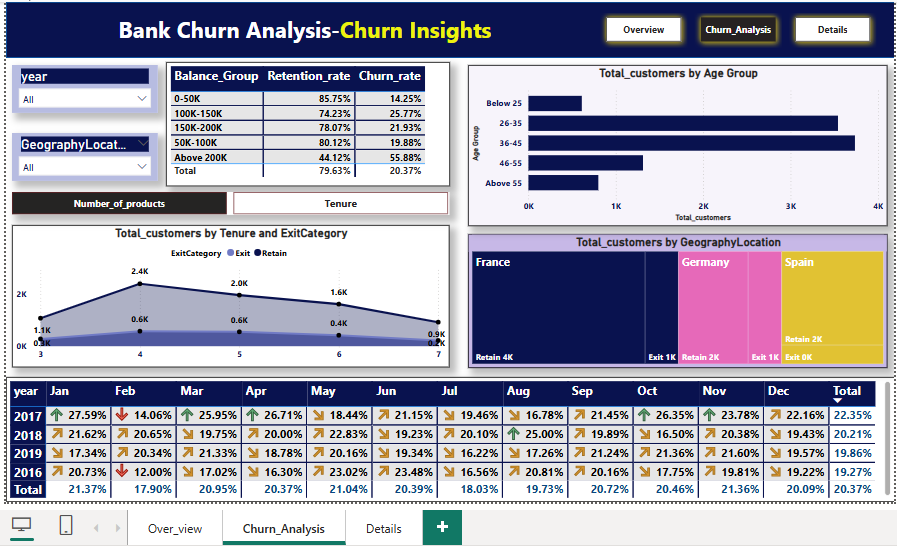

# 💼 Bank Customer Churn Analysis

This Power BI project explores customer churn patterns using a dataset of 10,000 bank customer records. The goal is to understand why customers leave and help the bank retain them through data-driven strategies.

---

## 🎯 Project Objectives

- Detect patterns in churn by **month, geography, activity status, credit card usage, tenure, and balance**
- Empower business stakeholders with **clear visuals, slicers, and insights**
- Provide **actionable recommendations** to reduce churn and improve customer retention

---

## 📊 Report Structure (3 Pages)

### 🧾 Page 1: Overview
- KPIs: **Total Customers**, **Exited Customers**, **Active Customers**
- **Monthly Churn Trend** (e.g., 307 exits in November)
- **Churn Breakdown** by:
  - Activity Status
  - Credit Card Status
- Interactive **Slicers**: Year, Gender, Geography, Exit Category

### 🔍 Page 2: Churn Insights
- Churn by:
  - **Balance Groups**
  - **Age Groups**
  - **Tenure Ranges**
- **Churn % Matrix** by Year & Month
- **Geography Treemap**:
  - 🇫🇷 France – Highest Retention
  - 🇪🇸 Spain – Highest Churn

### 📋 Page 3: Customer Details
- **Full Customer Table** with filters:
  - Age, Credit Score, Balance, etc.
- Designed for **analysts and managers** to explore individual-level data

---

## 🔑 Key Insights

- **Churn Rate**: 20.4% overall
- 📆 **November Churn Spike**: 307 exits → **429% ↑** from February
- 💳 **69.9%** of churned customers had **credit cards**
- 🧑‍💼 **Inactive users** churned at **26%**, vs. 14% for active users
- 🌍 **France** had the most retained customers; **Spain** had the most exits
- 💰 Customers with **₹200K+ balance** had a **56% churn rate**

---

## 📈 Business Recommendations

- 🎁 Launch **loyalty/reward programs** for credit card users
- 📣 **Proactive outreach** in October–November to prevent churn spikes
- 🔄 Re-engage the **4,849 inactive customers**
- ✅ Improve experience for users with **“Fair” credit types**

---

## 🛠️ Tech Stack

- **Power BI**
  - Visuals: Cards, Line Chart, Treemap, Matrix, Pie Chart, Table
  - Features: Slicers, Smart Narrative, Bookmarks, Navigation, RLS
- **Deployment**: Published as **Power BI App** with refresh enabled

---

## 📎 Preview

> ℹ️ *(Replace the above image path with your actual image location in your repo)*

---

## 📁 Dataset

- Contains 10,000 records with features such as:
  - Age, Geography, Gender, Balance, Credit Score, Tenure, IsActiveMember, HasCrCard, and more.

---

## 📌 Conclusion

This dashboard helps stakeholders **visualize, monitor, and reduce customer churn** by highlighting actionable patterns and enabling data-informed decision-making.
